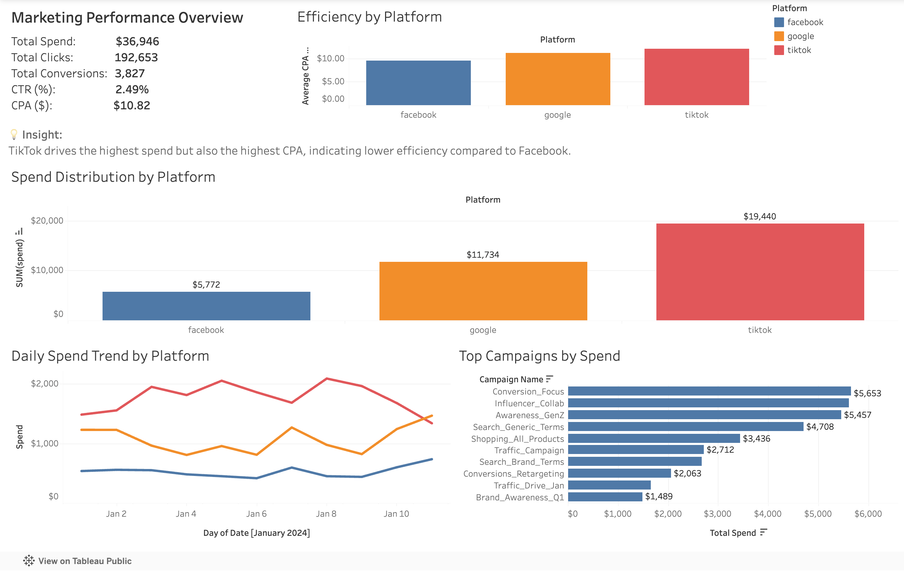

# Marketing Analyst Assignment — Improvado

This project was completed as part of the **Senior Marketing Analyst Technical Assignment** for **Improvado**.

## Project Overview

The objective of this assignment was to unify advertising performance data from three major marketing platforms and transform it into a reporting-ready data model for cross-channel analysis.

The project includes:

- ingestion of raw CSV data into a cloud PostgreSQL database using Supabase
- SQL-based transformation into a unified reporting table
- a reporting view with derived KPIs for BI analysis
- QA validation checks to confirm data completeness and consistency
- documentation of schema mapping and data dictionary
- a Tableau dashboard for cross-channel performance analysis

## Data Sources

The following source files were provided in the assignment:

- `01_facebook_ads.csv`
- `02_google_ads.csv`
- `03_tiktok_ads.csv`

These files contain advertising performance data from Facebook Ads, Google Ads, and TikTok Ads.

## Tech Stack

- **Database:** Supabase (PostgreSQL)
- **SQL:** PostgreSQL SQL
- **BI Tool:** Tableau Public
- **Scripting:** Python (pandas) for source data inspection only
- **Version Control:** Git / GitHub

## Project Structure

```text
marketing-analyst-assignment-improvado/
│
├── README.md
├── requirements.txt
├── .gitignore
│
├── data/
│   ├── raw/
│   │   ├── 01_facebook_ads.csv
│   │   ├── 02_google_ads.csv
│   │   └── 03_tiktok_ads.csv
│   │
│   └── processed/
│       └── ads_performance_reporting.csv
│
├── scripts/
│   └── inspect_source_data.py
│
├── sql/
│   ├── 01_create_raw_tables.sql
│   ├── 02_create_unified_table.sql
│   ├── 03_qa_checks.sql
│   └── 04_create_reporting_view.sql
│
├── docs/
│   ├── data_dictionary.md
│   ├── schema_mapping.md
│   └── assignment_notes.md
│
└── tableau/
    ├── dashboard_notes.md
    └── dashboard.png
```

## Data Modeling Approach

The data pipeline is structured into three layers to ensure scalability, clarity, and data quality.

### 1. Raw Layer

Each source dataset is ingested into its own table:

- `facebook_ads_raw`
- `google_ads_raw`
- `tiktok_ads_raw`

This preserves source-level data and allows for easier debugging and validation.

---

### 2. Unified Layer

A consolidated table, `ads_performance_unified`, is created to standardize all platforms into a single schema.

#### Key transformations include:

**Standardizing spend:**

- `spend` (Facebook)
- `cost → spend` (Google, TikTok)

**Standardizing ad group fields:**

- `ad_set_id`, `ad_group_id`, `adgroup_id` → `ad_group_id`
- `ad_set_name`, `ad_group_name`, `adgroup_name` → `ad_group_name`

**Additional transformations:**

- Adding a `platform` field to identify the data source
- Preserving platform-specific metrics while setting unavailable fields to `NULL`

---

### 3. Reporting Layer

A reporting view, `ads_performance_reporting`, is built on top of the unified table.

This layer introduces standardized KPI calculations:

- `calc_ctr = clicks / impressions`
- `calc_cpc = spend / clicks`
- `calc_cpa = spend / conversions`

This separation ensures:

- cleaner data modeling
- easier QA validation
- consistent reporting logic

---

## QA and Validation

A dedicated QA script validates:

- row count consistency between raw and unified tables
- platform-level distribution
- null checks on critical fields
- negative values in metrics
- duplicate grain validation
- consistency of spend between raw and unified layers
- correctness of calculated KPI fields

---

## Documentation

- `docs/schema_mapping.md`  
  Defines how source fields are mapped into the unified schema

- `docs/data_dictionary.md`  
  Defines column meanings, types, and usage

- `docs/assignment_notes.md`  
  Tracks setup notes and project decisions

---

## Tableau Dashboard

A one-page interactive dashboard was built to analyze cross-channel marketing performance.

### Key Features

- KPI summary (Spend, Clicks, Conversions, CTR, CPA)
- Spend distribution by platform
- Efficiency comparison (CPA by platform)
- Daily performance trend
- Top campaigns by spend
- Interactive filtering by platform

### Key Insight

- TikTok has the highest spend but also the highest CPA, indicating lower efficiency compared to other platforms.

### Tools Used

- Tableau Public
- PostgreSQL (Supabase)
- SQL + Python (data preparation)

## Dashboard Preview



### Live Dashboard

[View on Tableau Public](https://public.tableau.com/app/profile/yilin.yang1612/viz/ads_performance_reporting/MarketingPerformanceDashboard)
